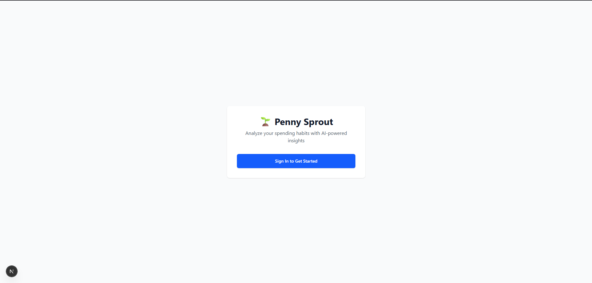
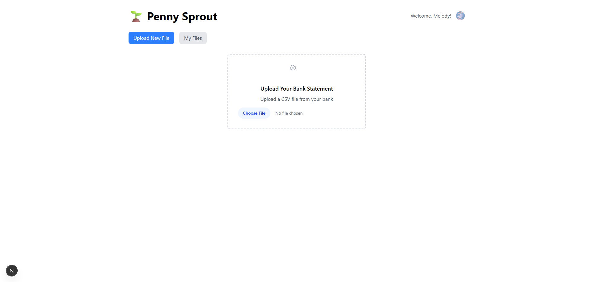
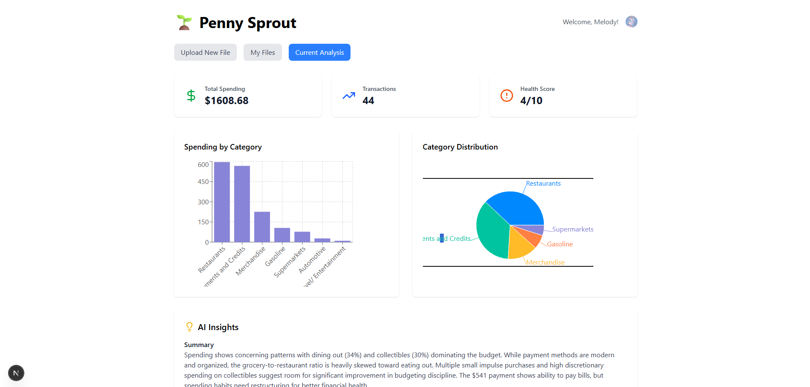
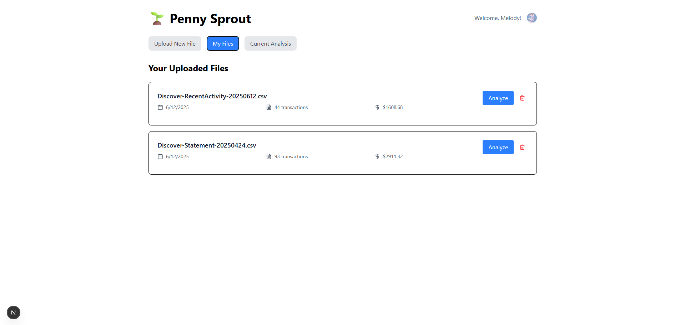

# 🌱 Penny Sprout

An AI-powered personal finance analyzer that helps you understand your spending habits and make smarter financial decisions.

## Features

- **CSV Upload & Analysis**: Upload bank statement CSV files for instant analysis
- **AI-Powered Insights**: Get personalized spending recommendations using Claude AI
- **Visual Analytics**: Interactive charts showing spending patterns and category breakdowns
- **File Management**: Save and manage multiple financial files with analysis history
- **User Authentication**: Secure login with Clerk authentication
- **Health Score**: Get a financial health score from 1-10 based on your spending patterns

## Tech Stack

- **Frontend**: Next.js 14, React, Tailwind CSS
- **Charts**: Recharts for data visualization
- **Authentication**: Clerk
- **AI**: Anthropic Claude API
- **Storage**: File-based JSON storage (⚠️for now, will be creating a database for it in the near future)
- **Icons**: Lucide React

## Getting Started

### Prerequisites

- Node.js 18+ 
- npm or yarn
- Anthropic API key
- Clerk account and API keys

### Installation

1. Clone the repository:
```bash
git clone <your-repo-url>
cd penny-sprout
```

2. Install dependencies:
```bash
npm install
```

3. Set up environment variables:
Create a `.env.local` file in the root directory:
```env
ANTHROPIC_API_KEY=your_anthropic_api_key_here
NEXT_PUBLIC_CLERK_PUBLISHABLE_KEY=your_clerk_publishable_key
CLERK_SECRET_KEY=your_clerk_secret_key
```

4. Run the development server:
```bash
npm run dev
```

5. Open [http://localhost:3000](http://localhost:3000) in your browser.

## Usage

### 1. Sign In
- Click "Sign In to Get Started" to authenticate with Clerk
- Create an account or sign in with existing credentials



### 2. Upload CSV Files
- Navigate to "Upload New File"
- Select a CSV file from your bank or financial institution
- The app will automatically parse and save your transaction data



### 3. View Analysis
- After upload, the AI will analyze your spending patterns
- View interactive charts showing:
  - Spending by category
  - Category distribution
  - Transaction summaries
- Get personalized recommendations and insights



### 4. Manage Files
- Access "My Files" to see all uploaded financial data
- View analysis history and health scores
- Delete files when no longer needed



## CSV Format Requirements

Your CSV file should include columns for:
- **Date**: Transaction date (various formats supported)
- **Description**: Transaction description
- **Amount**: Transaction amount (positive or negative)
- **Category**: Spending category (optional)

Example CSV structure:
```csv
Trans. Date,Description,Amount,Category
2024-01-15,Coffee Shop,-4.50,Food
2024-01-16,Salary,2500.00,Income
2024-01-17,Gas Station,-45.20,Transportation
```

## AI Analysis Features

The Claude AI provides:
- **Top Spending Categories**: Breakdown of where your money goes
- **Spending Patterns**: Identification of habits and trends
- **Money-Saving Opportunities**: Actionable advice to reduce expenses
- **Budget Recommendations**: Personalized budgeting suggestions
- **Health Score**: Overall financial wellness rating (1-10)

## Project Structure

```
penny-sprout/
├── app/
│   ├── api/
│   │   ├── analyze/          # AI analysis endpoint
│   │   └── files/            # File management endpoints
│   ├── components/
│   │   ├── FileUpload.js     # CSV upload component
│   │   ├── SpendingDashboard.js # Main analytics dashboard
│   │   └── UserFiles.js      # File management UI
│   ├── globals.css           # Global styles
│   ├── layout.js             # Root layout with Clerk
│   └── page.js               # Main application page
├── lib/
│   └── fileStorage.js        # File system storage utilities
└── data/                     # JSON file storage (created automatically)
```

## API Endpoints

- `POST /api/analyze` - Analyze spending data with AI
- `GET /api/files` - Get user's uploaded files
- `POST /api/files` - Save new file
- `DELETE /api/files/[fileId]` - Delete specific file

## Security & Privacy

- User authentication handled by Clerk
- File data stored locally per user
- No sensitive financial data sent to external services except Anthropic for analysis
- Transaction data is limited to first 50 entries for AI analysis

## Customization

### Adding New Chart Types
Extend the `SpendingDashboard.js` component with additional Recharts components.

### Modifying AI Analysis
Update the prompt in `app/api/analyze/route.js` to request different insights or analysis formats.

### Styling
The app uses Tailwind CSS for styling. Customize colors and layout in the component files.

## Contributing

1. Fork the repository
2. Create a feature branch: `git checkout -b feature-name`
3. Commit changes: `git commit -am 'Add new feature'`
4. Push to branch: `git push origin feature-name`
5. Submit a Pull Request

## License

This project is licensed under the MIT License - see the LICENSE file for details.

## Support

For issues and questions:
- Check existing GitHub issues
- Create a new issue with detailed description
- Include error messages and steps to reproduce

## Roadmap

Future enhancements may include:
- Database integration (PostgreSQL/MongoDB)
- Export functionality for reports
- Goal setting and tracking
- Mobile app version
- Integration with banking APIs
- Multi-currency support

---

Made with ❤️ for better financial wellness